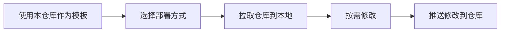
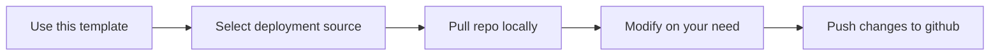

# less style, please!


<hr id="zh"></hr>

**中文** | [English](#en) | [Wiki](#wiki)

纯文本风格Jekyll博客主题，基于rigggraz的[no_style_please](https://github.com/riggraz/no-style-please)，具有基于分类的树形结构，可系统地组织关于不同主题的文章，支持手动索引外部平台的内容，可将你的全部创作统一整合为一个网站。

- 继承
  - 极简且克制的设计风格，适合主要专注于文本内容的网站
  - 动态明暗主题
- 改进
  - 配色方案改为低饱和度、低对比度的风格
  - 表格自适应与隔行变色
  - 综合发布时间与修改时间的智能博文排序
  - PWA支持
  - 自托管的中文webfont（仅限完整版）

## 使用方法


```mermaid
flowchart LR
A[使用本仓库作为模板] --> B[选择部署方式] --> C[拉取仓库到本地] --> D[按需修改] --> E[推送修改到仓库]
```

### 1. 创建仓库并选择部署方式

- 登录 GitHub，[用本仓库作为模板](https://github.com/new?template_name=less-style-please&template_owner=feeshy)创建一个名为 `你的用户名.github.io`的仓库
- 进入 **Settings → Pages → Build and deployment**，选择通过 GitHub Actions 部署

### 2. 设置 remote theme 分支

- 使用任意 git 工具将仓库拉取到本地
  - 推荐代码编辑器：[VS Code](https://code.visualstudio.com/docs/sourcecontrol/github)
  - 推荐帖子编辑器：[Obsidian + obsidian-git plugin](https://forum.obsidian.md/t/51429)
- 编辑 `_config.yml` 文件，修改 `title`、`description`、`author` 等基本信息。**设置 `remote_theme` 启用对应分支**：
  - **完整版**：```remote_theme: feeshy/less-style-please@full```
    - 体积约 15 MB，内置了霞鹜文楷和思源宋体的 webfont
    - 适合对中文字体与字重有较高要求的站点（主要影响标签与块状引用的中文显示效果，以及宋体类帖子的标题层级、加粗等格式）
  - **精简版**：```remote_theme: feeshy/less-style-please@lite```
    - 体积约 2.6 MB，相比完整版去除了中文 webfont
    - 以牺牲中文显示效果为代价，大幅度降低流量消耗、提升载入速度。
- 将 `general`、`literature` 目录重命名为符合你需求的文章分类（也可自行创建更多分类），在每个分类的 `_posts` 目录中添加或修改文章
- 编辑 `_data/menu.yml`，设置站点首页的树形层级
- 详细使用方法请参阅wiki https://github.com/feeshy/less-style-please/wiki/

### 3. 部署到 GitHub Pages

- 完成以上配置后，推送代码到GitHub，GitHub Actions 会自动构建并发布你的 Jekyll 站点。

<hr id="en"></hr>

[中文](#zh) | **English** | [Wiki](#wiki)

A pure text Jekyll blog theme forked from rigggraz's [no_style_please](https://github.com/riggraz/no-style-please), with a category-based tree structure for systematically organizing articles on diverse topics, and the ability to manually index external content to consolidate your entire content ecosystem into one single website.

- What Are Kept
  - Minimalist and reserved design style, ideal for pure text websites
  - Adaptive light and dark theme
- What Are Changed
  - Low-saturated color palette for both light and dark themes
  - Rowing color grades for tables
  - Intelligent Post Sorting Based on Publication and Modification Dates
  - PWA Ready
  - Self hosting web fonts for Simplified Chinese

## Usage


```mermaid
flowchart LR
A[Use this template] --> B[Select deployment source] --> C[Pull repo locally] --> D[Modify on your need] --> E[Push changes to github]
```

### 1. Create a new repository and select deployment source

* Log in to GitHub, [use this template](https://github.com/new?template_name=less-style-please&template_owner=feeshy) to create a repository named as `your-username.github.io`.
* Go to **Settings → Pages → Build and deployment**, and select to deploy via **GitHub Actions**.


### 2. Pull locally and set up

* Use any git tools to pull the repository to your local machine.
  * Recommended code editor: [VS Code](https://code.visualstudio.com/docs/sourcecontrol/github)
  * Recommended post editor: [Obsidian + obsidian-git plugin](https://forum.obsidian.md/t/51429)
* Edit the `_config.yml` file to modify basic information such as `title`, `description`, and `author`. Set `remote_theme` to enable the corresponding branch:
  * **Full Version**: `remote_theme: feeshy/less-style-please@full`
    * Approx. 15 MB, with built-in Chinese webfonts for 霞鹜文楷 and 思源宋体.
    * Ideal for sites demanding precise Chinese typography and weights. It chiefly enhances Chinese rendering for tags and blockquotes, alongside heading hierarchies and bold formatting for serif layout posts.
  * **Lite Version**: `remote_theme: feeshy/less-style-please@lite` 👈 **recommend for non-Chinese writers**
    * Approx. 2.6 MB, removing the Chinese webfonts compared to the full version.
    * Significantly reduces traffic consumption and improves loading speed at the expense of Chinese display quality.
* Rename the `general` and `literature` directories to post categories that meet your needs (you can also create more categories yourself), and add or modify posts in the `_posts` directory of each category.
* Edit `_data/menu.yml` to set the tree hierarchy for the site's homepage.
* Edit `.github/workflow/Jekyll.yml` to custom building and deployment settings. (Optional)
* For detailed instructions, please refer to the wiki https://github.com/feeshy/less-style-please/wiki/

### 3. Push commits and deploy

* After completing the above configurations, push the code to GitHub, and GitHub Actions will automatically build and deploy your Jekyll site.

<hr id="wiki"></hr>

[中文](#zh) | [English](#en) | **Wiki**

## Wiki

- 中文
  - [设计](https://github.com/feeshy/less-style-please/wiki/1-%E8%AE%BE%E8%AE%A1)
  - [使用方法](https://github.com/feeshy/less-style-please/wiki/2-%E4%BD%BF%E7%94%A8%E6%AD%A5%E9%AA%A4)
  - [帖子语法](https://github.com/feeshy/less-style-please/wiki/3-%E5%B8%96%E5%AD%90%E8%AF%AD%E6%B3%95)
  - [站点配置](https://github.com/feeshy/less-style-please/wiki/4-%E7%AB%99%E7%82%B9%E9%85%8D%E7%BD%AE)
- English
  - [Design](https://github.com/feeshy/less-style-please/wiki/1-Design)
  - [Usage](https://github.com/feeshy/less-style-please/wiki/2-Usage)
  - [Post Config](https://github.com/feeshy/less-style-please/wiki/3-Post-Config)
  - [Site Config](https://github.com/feeshy/less-style-please/wiki/4-Site-Config)