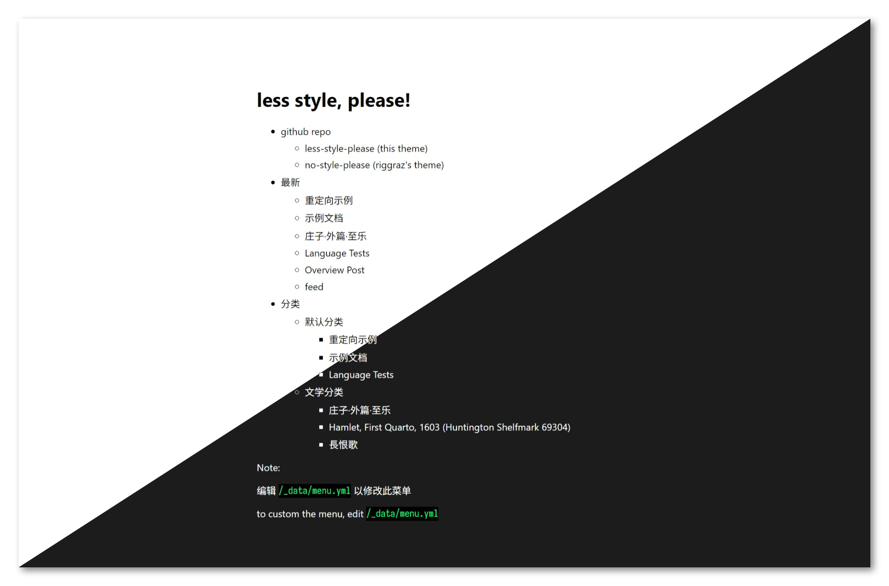

# 中文

Docs Language: 中文 | [English](#en)

纯文本风格Jekyll博客主题，fork自rigggraz的no_style_please[^riggraz]，具有基于分类的树形结构，可系统地组织关于不同主题的文章，支持手动索引外部平台的内容，可将你的全部创作统一整合为一个网站。



## 安装

|          | 远程主题        | 本地主题 |
| -------- | --------------- | -------- |
| 运行环境 | Github Actions  | 不限     |
| 主题更新 | 编译时自动      | 手动     |
| 修改定制 | 限于_config.yml | 完全     |

### 作为远程主题

复制 `_config.yml` `Gemfile` 文件到你的Github Pages仓库，按需设置。找到以下几行代码，取消注释

```yml
# remote_theme: feeshy/less-style-please
# - jekyll-remote-theme # enable this if you use it as a remote theme
```

```gemfile
# gem "jekyll-remote-theme" # enable this if you use remote theme
```

在你的 GH Pages 仓库网页，依次找到 Settings > Pages > Build and deployment，选择 Github Actions

### 作为本地主题


- Github Pages：点击 Use this template
- 其他环境：[下载源码](https://github.com/feeshy/less-style-please/releases)

## 设计

### 继承

- 极简且克制的设计风格，适合主要专注于文本内容的网站
- 动态明暗主题

### 改进

- 配色方案改为低饱和度、低对比度的风格
- 表格自适应与隔行变色
- 自托管的中文webfont

字体搭配分为四个层次：

|                        | 首选字体                                                                                     | 候补字体                                                                                                                                                      |
| ---------------------- | -------------------------------------------------------------------------------------------- | ------------------------------------------------------------------------------------------------------------------------------------------------------------- |
| 通用内容               | Avenir Next<br>苹方                                                                          | Segoe UI, HarmonyOS Sans, [Clear Sans🌐](https://github.com/intel/clear-sans)<br>思源黑体 (Noto Sans CJK SC), 思源黑体 CN (Noto Sans SC), 更纱黑体, sans-serif |
| 文学性内容             | [EB Garamond🌐](https://github.com/octaviopardo/EBGaramond12)<br>思源宋体 (Noto Serif CJK SC) | Adobe Garamond Pro, Garamond, Palatino<br>[思源宋体 CN🌐](https://github.com/adobe-fonts/source-han-serif) (Noto Serif SC), serif                              |
| 元数据<br>引用<br>注释 | [Ysabeau🌐](https://github.com/CatharsisFonts/Ysabeau)<br>霞鹜文楷                            | [霞鹜文楷轻便版🌐](https://github.com/lxgw/LxgwWenKai-Lite), 华文细黑, 冬青黑体, sans-serif                                                                    |
| 表格<br>代码           | 等距更纱黑体                                                                                 | Ubuntu Mono🌐, Inconsolata, Iosevka, JetBrains Mono, Monaco, Source Code Pro, 思源黑体HW (Noto Sans Mono CJK), 文泉驿等宽微米黑, monopace                      |

标🌐的字体使用[cn-font-split](https://github.com/KonghaYao/cn-font-split)切割为细粒度webfont并托管在`/assets/OpenFonts`目录，以期获得稳定的跨平台效果。

考虑到流量消耗，各大系统均预装的黑体并未托管webfont。安卓Droid Sans Fallback缺字重的问题通过浏览器font-synthesis合成解决。Safari似乎有可变Webfont重复合成字重的bug，考虑到iOS预装的苹方不缺字重，干脆禁用了macOS与iOS的font-synthesis。

思源黑体HW (Noto Sans Mono CJK)与文泉驿等宽微米黑均未明显区分`1ilIL`、`0O`的等宽字体，不算特别适合代码显示。但考虑到本博客表格多于代码，等宽字族的设计主要以西文宽度等于0.5、0.6个中文字符为标准，以满足表格中文、数字、英文混排的对齐需求。

## 帖子语法

示例页面: [markdown](/general/_posts/2024-04-11-example.md) -> [网页](https://feeshy.github.io/less-style-please/general/example)

### 基础元数据

帖子必须按以下形式存储和命名: `/category/sub-category/_post/yyyy-mm-dd-title.md`

#### 标题

文件名 `yyyy-mm-dd-title.md` 已包含帖子标题。可通过front matter中的声明覆盖：

``` yml
---
title: yyyy-mm-dd
---
```

#### 日期

文件名 `yyyy-mm-dd-title.md` 已包含创建日期。可通过front matter中的声明覆盖：

``` yml
---
date: yyyy-mm-dd
---
```

帖子发布后，如需进一步编辑，请在正文中添加新语法：

``` yml
---
last_modified_at: yyyy-mm-dd
---
```

如果定义了 `last_modified_at`，则更新日期将在帖子的元数据模块中呈现。这个属性对于sitemap[^sitemap]也非常实用

#### 分类

建议用目录的层级设置类别： `/category/sub-category/_post/yyyy-mm-dd-title.md`

如果更喜欢全部帖子混在一块儿的管理方式，也可以在front matter定义类别：

``` yml
---
categories: [category, sub-category]
---
```

#### 标签

``` yml
---
tags: [tags1, tags2]
---
```

按需设置。帖子的标签会在正文前的元数据模块呈现。

### 样式

``` yml
---
layout: post
---
```

本主题定义了有五种样式

- 会出现在文章列表的样式
	- post：两端对齐，在正文前渲染元数据（标签、创建日期、更新日期、重定向链接）
	- poetry: 居中对齐，不渲染元数据
	- redirect: 以 page 为蓝本，重定向到 `redirect_to` 定义的地址。放置在`_posts`目录内，可以让站外内容以与 post 相同的优先级排列在文章列表
- 不出现在文章列表的样式
  - page：以 post为蓝本, 去掉元数据与标题
 	- redirect: 以 page 为蓝本，重定向到 `redirect_to` 定义的地址。不放置在`_posts`目录内，可以作为不外显的跳转页使用
	- archive: 文章列表本身

### 目录[^toc]

``` yml
---
toc: true
---
```

### 重定向

#### 从本帖跳转到新URL

在front matter用如下语法定义（你可以通过控制它的文件名和目录，来决定它是否会出现在帖子列表）

``` yml
---
layout: redirect
redirect_to: /destination/url/here
canonical_url: https://www.example.com/destination/url/here
---
```

还可搭配permalink语法

```yml
---
permalink: /url/to/redirect/from
---
```

由于Github不支持服务器端的301重定向，这里会使用三种替代的重定向方式：

- 利用 http refresh meta tag 重定向
- 利用 javascript 重定向
- 会在正文前渲染一个指向所设定URL的超链接，前两种方式都失效的情况下，用户依旧可以手动点击

此语法不仅适用于重定向网站内的页面，还可以用于重定向网站外的文章，以便外部内容可以获得与网站上的帖子相同的元数据索引，并显示在同一帖子列表中。当您想要将在不同平台上发布的所有内容合并到一个地方时，它可能会非常方便。

#### 从站内旧URL跳转到本帖

在目标帖用如下语法定义

``` yml
---
redirect_from:
  - https://example.com/oldurl
  - /old-dir/old-url-1
  - /old-dir/old-url-2
---
```

适合修改过目录名称、或者把以前在站外发布的内容重新搬回站内的场景

这个功能依赖jekyll-redirect-from插件[^redirect]。同时会在帖子元数据模块中创建日期的位置渲染一个指向第一行URL的超链接。

### 阻止搜索引擎编入索引

> noindex 是一个包含 meta 标记或 HTTP 响应标头的规则集，用于防止支持 noindex 规则的搜索引擎（例如 Google）将内容编入索引。当 Googlebot 抓取该网页并发现该标记或标头时，Google 就会完全阻止该网页出现在 Google 搜索结果中，不论是否有其他网站链接到该网页。

``` yml
---
noindex: true
---
```

### 文学字体与首字下沉

用以下语法启用[文学性字体集合](#改进)（可在 `_config.yml` 中配置默认启用该字体集合的帖子目录）

``` yml
---
fonts: serif
---
```
用以下语法启用首字下沉效果

``` yml
---
dropcap: true
---
```


### 指定帖子语言

如果文章使用的语言不是 `_config.yml` 中默认的语言，可以在 front matter 定义 lang 与 locale

``` yml
---
lang: zh-yue
locale: zh-yue_HK
---
```
标准 [language codes](https://www.w3schools.com/tags/ref_language_codes.asp) & [territory codes](https://www.w3schools.com/tags/ref_country_codes.asp)

此外，可以用 html 语法指定特定区块的语言，浏览器会自动对中文用户隐藏非中文的内容，对非中文用户隐藏中文内容。

``` html
<span lang="zh">对中文用户显示的内容</span><span lang="en">displaying content for English users</span>
```

### 版权协议

主题会自动在页面底部渲染文章的版权声明。如果文章使用的版权协议不是 `_config.yml` 中默认的协议，可以在 front matter 定义本文章所使用的 copyright：

``` yml
---
copyright: public-domain
---
```

支持的协议包括: ```"all-rights-reserved", "by-nc-nd", "by-nd", "by-nc-sa", "by-nc", "by-sa", "by", "public-domain"```

其中[Creative Commons协议](https://creativecommons.org/share-your-work/cclicenses/)会根据页面的语言自动跳转到相应版本的官方译文

### 表情包

使用html语法，将表情包指定为sticker的类

```html

```

### 在 Html 头部插入任何字符串

通过 `custom_head` 语法定义的任意字符串都将插入到渲染的 html 文件头。

``` yml
---
custom_head: ""
---
```

例如，如果您希望帖子不要被搜索引擎收录，只需在 front matter 输入 `custom_head: "<meta name='robots' content='noindex'>"` 

## 站点配置

编辑根目录下的 `/_config.yml` 以进行网站配置

### 站点基础信息

请阅读 [jekyll-seo-tag](https://github.com/jekyll/jekyll-seo-tag/blob/master/docs/usage.md) 文档[^seo]

### PWA

#### 图标和Manifest.json

- 从您的设计软件中导出应用图标（或使用在线工具生成它们）
  - 矢量图标 `favicon.svg` 🛠️[在线生成](https://realfavicongenerator.net/svg-favicon/)
  - 32x32 `favicon.ico`, iOS使用的 180x180 png 🛠️[在线生成](https://realfavicongenerator.net/)
  - chrome PWA 使用的 192x192 and 512x512 png 🛠️[在线生成](https://maskable.app/editor/)
- 将图标放在项目的根目录下
- 在 `_config.yml` 按实际情况修改图标的文件名

``` yml
favicon:
  ico: "/favicon.ico" # legacy 'favicon.ico' at the root folder of your site, it is highly recommended not changing this name
  svg: "/favicon.svg" # name+extension of modern vector favicon
  ios: "/maskable-180x180.png" # icon for Safari
ms_tile_color: "#da532c" # hex background for windows 8.1~10 tile
webmanifest: "/site.webmanifest" # icon config file path for Chrome
```

#### Service-Worker.js

请阅读jekyll-pwa-workbox文档[^pwa]

### 中文网字

默认启用，如果希望大幅度降低流量消耗、提升响应速度，可以关闭。

```yml
chinese_webfonts: true
```

### 文章列表

在 `/category/index.md` 创建每个分类的文章列表，使用以下front matter：

``` yml
---
layout: archive
categories: category name
title: page title
---
[optional]you could add some content here, it will be rendered before post list
```

年份文章列表与标签文章列表由jekyll-archives[^archives]插件自动生成。

[^archives]: [jekyll-archives](https://github.com/jekyll/jekyll-archives)

你也可以创建一个各标签的汇总列表

```yml
---
layout: tags
title: 标签
---
```

### 首页

首页内容存储在项目根目录下的 `/index.md` 中。

``` yml
---
layout: home
---
[optional]you could add some content here, it will be rendered after menu
```

首页的列表存储在 `/_data/menu.yml`，您可以从主页设置到指向存档页面的链接，详细步骤请阅读 [no-style-please](https://github.com/riggraz/no-style-please) 上的原始文档[^riggraz]。

### Markdown 解析器

Jekyll默认的kramdown[^kramdown]引擎有一个bug，会将任何未转义的 `|` 渲染为单行表，该错误已经存在了 [数十年](https://stackoverflow.com/questions/23751917/how-do-you-disable-tables-in-kramdown）。在 kramdown 和 jekyll 的存储库中，时不时都会出现提及该错误的 issue，其中大多数都因超时而关闭。考虑到该 bug 修复基本无望，我的主题版本中默认的 markdown 引擎设置为redcarpet[^redcarpet]。

默认启用 6 种非标准标记符语法："tables", "autolink", "strikethrough", "highlight", "footnotes", "with_toc_data"。更多用法请阅读redcarpet[^redcarpet]上的原始文档。

---

# en

Docs Language: [中文](/#中文) | English

The English doc is translate via Gemini Pro and verified by feeshy.

A pure text Jekyll blog theme forked from rigggraz's no_style_please[^riggraz], with a category-based tree structure for systematically organizing articles on diverse topics, and the ability to manually index external content to consolidate your entire content ecosystem into one single website.


## Install

|                       | remotely                  | locally   |
| --------------------- | ------------------------- | --------- |
| Operating environment | Github Actions            | Unlimited |
| Theme updates         | Automatically at building | manually  |
| mods on source codes  | limited to _config.yml    | Full      |

### Install as a Remote Theme on Github Pages

Copy the `_config.yml` & `Gemfile` file to your Github Pages repository and set it up as desired. Find the following two lines of code and uncomment them:

```yml
# remote_theme: feeshy/less-style-please
# - jekyll-remote-theme # enable this if you use it as a remote theme
```

```gemfile
# gem "jekyll-remote-theme" # enable this if you use remote theme
```
In your GH Pages repo, browse to Settings > Pages > Build and deployment, select GitHub Actions, commit changes

### Install as a Local Theme

- Github Pages: click 'Use this template'
- Other environments: fork the project or [download the source code](https://github.com/feeshy/less-style-please/releases)

## Design

### What Are Kept

- Minimalist and reserved design style, ideal for pure text websites
- Adaptive light and dark theme

### What Are Changed

- Low-saturated color palette for both light and dark themes
- Rowing color grades for tables
- Self hosting web fonts for Simplified Chinese

## Usage on Post

example page: [markdown](/general/_posts/2020-07-07-overview-post.md) -> [webpage](https://feeshy.github.io/less-style-please/general/overview-post)

### Basic Post Meta Info

A post is always supposed to be stored in the following naming pattern: `/category/sub-category/_post/yyyy-mm-dd-title.md`

#### Title 

The title is required in the filename `yyyy-mm-dd-title.md`. Could be overwritten in the front matter:

``` yml
---
title: yyyy-mm-dd
---
```

#### Date

A date is already defined in the filename `yyyy-mm-dd-title.md`. Could be overwritten in the front matter:

``` yml
---
date: yyyy-mm-dd
---
```

For further edits after the post is published, add a new syntax in the front matter:

``` yml
---
last_modified_at: yyyy-mm-dd
---
```

If `last_modified_at` is set, a updated date will be rendered in metadata section of the post. This attribute is also quite useful for sitemap[^jekyll-sitemap]

#### Categories

Categories could be set with hierarchical directories: `/category/sub-category/_post/yyyy-mm-dd-title.md`

you may also define categories in the front matter of the post:

``` yml
---
categories: [category, sub-category]
---
```

#### Tags

``` yml
---
tags: [tags1, tags2]
---
```

Set tags on your need. Tags of a post will be rendered on the post-meta section.

### Layout

``` yml
---
layout: post
---
```

There are 5 types of layouts

- appears on post list
	- post：justify aligned, meta data rendered if set (tags, created date, updated date, redirected url)
	- poetry: center aligned, w/o meta data
	- redirect: like page, w/ redirecting hyperlinks and javascripts and noindex meta tag, w/o meta data
- not appears on post list
	- page：like post, w/o meta data
	- redirect: like page, w/ redirecting hyperlinks and javascripts and noindex meta tag, w/o meta data
	- archive: the layout of a post list page

### Table of Contents[^toc]

``` yml
---
toc: true
---
```

### Redirecting

#### From the Post to a New URL

Defined in front matter with the following syntax (you can control its filename and directory to determine whether it appears in the list of posts)

``` yml
---
layout: redirect
redirect_to: /destination/url/here
canonical_url: https://www.example.com/destination/url/here
---
```

can also be used with the permalink syntax

```yml
---
permalink: /url/to/redirect/from
---
```
```

Considering server-side 301 redirecting is not supported by github pages, three alternative ways to redirect is provided:

- redirect via http refresh meta tag
- redirect via javascript
- user manually click on the hyperlink rendered on the webpage

This syntax is not only applicable to redirecting pages on the site, but can also be used to redirect articles outside of the site, so that external content may obtain the same metadata index as posts on the site and be displayed in the same post list. It could be quite handy when you want to consolidate all content you posted on different platforms to one single place.

#### From Old URLs to the Post

``` yml
---
redirect_from:
  - https://example.com/oldurl
  - /old-dir/old-url-1
  - /old-dir/old-url-2
---
```

Requiring jekyll-redirect-from plugin[^redirect]. The URL in the first row will be rendered as a hyperlink at the position of the creation date.

### Exclude the Post from Search Results

> noindex is a rule set with either a <meta> tag or HTTP response header and is used to prevent indexing content by [search engines that support the noindex rule](https://developers.google.com/search/docs/crawling-indexing/block-indexing), such as Google. When Googlebot crawls that page and extracts the tag or header, Google will drop that page entirely from Google Search results, regardless of whether other sites link to it.

``` yml
---
noindex: true
---
```

### Serif Font set and Drop Cap

Enable the [Literary Font Set](#改进) by entering the following syntax on front matter (configure `_config.yml` to set the default post directories to enable this font set)

``` yml
---
fonts: serif
---
```
and you can enable drop caps on demand:

``` yml
---
dropcap: true
---
```


### Post Language

If the post is written in an language other than the default language in `_config.yml`, you may define the lang at front matter.

``` yml
---
lang: zh-yue
locale: zh-yue_HK
---
```

standard [language codes](https://www.w3schools.com/tags/ref_language_codes.asp) & [territory codes](https://www.w3schools.com/tags/ref_country_codes.asp)

And you may define the language of a span with html syntax. The browser will hide Chinese content for English users, and hide non-Chinese content for Chinese users.

``` html
<span lang="zh">对中文用户显示的内容</span><span lang="en">displaying content for English users</span>
```

### Copyright Disclaimer

Copyright disclaimers are automatically generated at the bottom of the page. If the article uses a copyright license other than the defaulted value in `_config.yml`, you can define the license in front matter:

``` yml
---
copyright: public-domain
---
```

available values: ```"all-rights-reserved", "by-nc-nd", "by-nd", "by-nc-sa", "by-nc", "by-sa", "by", "public-domain"```

The [Creative Commons license](https://creativecommons.org/share-your-work/cclicenses/) will automatically redirect to the appropriate version of the official translation based on the language of the post

### inline stickers

use html syntax

```html

```

### Insert Anything to Html Head

Any string of `custom_head` in the front matter will be inserted to the rendered html file.

``` yml
---
custom_head: ""
---
```

If you want the post excluded from search engine, for instance, just type `custom_head: "<meta name='robots' content='noindex'>"` in your front matter.

## Site Configuration

edit `/_config.yml` root in the root directory for site configurations

### Basic Site Info

read docs of [jekyll-seo-tag]((https://github.com/jekyll/jekyll-seo-tag/blob/master/docs/usage.md)[^seo-tag]

### PWA

#### App Icons & Web Manifest

- Export app icons from your designer software (or generate them with online tools)
  - a modern light-dark vector `favicon.svg` 🛠️[online tool](https://realfavicongenerator.net/svg-favicon/)
  - a 32x32 `favicon.ico` for old browser, a 180x180 png for iOS 🛠️[online tool](https://realfavicongenerator.net/)
  - 192x192 and 512x512 maskable pngs for chrome PWA 🛠️[online tool](https://maskable.app/editor/)
- Put the icons in the root directory of the project
- edit `_config.yml` on your need

``` yml
favicon:
  ico: "/favicon.ico" # legacy 'favicon.ico' at the root folder of your site, it is highly recommended not changing this name
  svg: "/favicon.svg" # name+extension of modern vector favicon
  ios: "/maskable-180x180.png" # icon for Safari
ms_tile_color: "#da532c" # hex background for windows 8.1~10 tile
webmanifest: "/site.webmanifest" # icon config file path for Chrome
```

#### Service-Worker.js

read docs of jekyll-pwa-workbox[^pwa]

### Chinese webfonts

enabled by default. The loading speed of pages with a lot of Chinese characters will increase significantly if set to false.

```yml
chinese_webfonts: true
```

### Archive Page

Create an archive page at `/category/index.md` with the following front matter:

``` yml
---
layout: archive
categories: category name
title: page title
---
[optional]you could add some content here, it will be rendered before post list
```
Anually post lists and tagged post lists are automatically generated by the jekyll-archives[^archives] plugin. It is possible to create a summarized list of all tags

```yml
---
layout: tags
title: 标签
---
```

### Home Page

The content of home page is stored as `/index.md` in the root directory of your project.

``` yml
---
layout: home
---
[optional]you could add some content here, it will be rendered after menu
```

The menu on home page are stored as `/_data/menu.yml`. You could set link to the archive page from home page, read [the original docs](https://github.com/riggraz/no-style-please)[^riggraz] for detailed instructions.

## Markdown Parser

the default kramdown parser[^kramdown] has a bug that renders any unescaped `|` as single row tables, which has exist [for decades](https://stackoverflow.com/questions/23751917/how-do-you-disable-tables-in-kramdown). In both kramdown's and jekyll's repos there are issues mentioning the bug now and then, most of which are closed by timeout. Considering that there is no hope that the bug is being fixed, the default markdown engine in my version of theme is set as redcarpet[^redcarpet].

6 non standard flavored markdown syntax are enabled by default - "tables", "autolink", "strikethrough", "highlight", "footnotes", "with_toc_data". Read [the original docs](https://github.com/vmg/redcarpet?tab=readme-ov-file)[^redcarpet] for more usages.

---

[^riggraz]: [no_style_please](https://github.com/riggraz/no-style-please)
[^sitemap]: [jekyll-sitemap](https://github.com/jekyll/jekyll-sitemap)
[^toc]: [jekyll-toc](https://github.com/toshimaru/jekyll-toc)
[^redirect]: [jekyll-redirect-from](https://github.com/jekyll/jekyll-redirect-from)
[^seo]: [jekyll-seo-tag](https://github.com/jekyll/jekyll-seo-tag/blob/master/docs/usage.md)
[^pwa]: [jekyll-pwa-workbox](https://github.com/souldanger/jekyll-pwa-workbox)
[^kramdown]: [kramdown-parser-gfm](https://github.com/kramdown/parser-gfm)
[^redcarpet]: [redcarpet](https://github.com/vmg/redcarpet)
